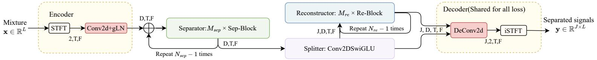
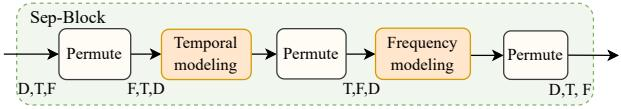
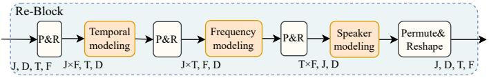
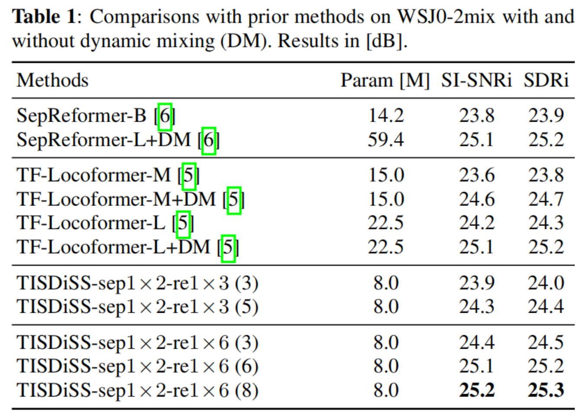
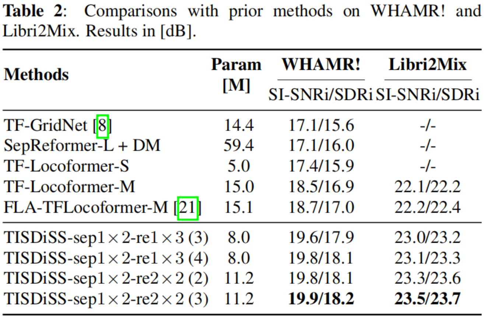

# TISDiSS: Training-Time and Inference-Time Scalable Framework for Discriminative Source Separation

<p align="center">
  
  
  
</p>

Official implementation of **TISDiSS**, a scalable framework for discriminative source separation that enables flexible model scaling at both training and inference time.

## News

- **[2025-10-18]** We release the code and [pre-trained model](egs2/wsj0_2mix/enh1/exp/enh_train_enh_tisdiss_tflocoformer_en-residual_en1x2_re1x6_l1+1x6_raw) of TISDiSS! 🚀 [Hugging Face](https://huggingface.co/WingsingFung/TISDiSS)

## 🏆 Highlights

- **State-of-the-art Performance**: Achieves SOTA results on WSJ0-2mix, WHAMR!, and Libri2Mix datasets
- **Dynamic Inference**: Adjustable Reconstruction block repeat times (N_re) at inference stage for performance-efficiency trade-offs without retraining
- **Effective Training Strategy for Low-Latency Separation**: Training with more inference repetitions consistently improves shallow-inference performance, offering a practical solution for low-latency separation

## 🖼️ Architecture

<div align="center">

### Overall Framework



### Separation Block



### Reconstruction Block



</div>

## 📊 Performance Comparison

### WSJ0-2mix Benchmark



### WHAMR! and Libri2Mix Benchmark



## 📄 Paper

**arXiv**: [https://arxiv.org/abs/2509.15666](https://arxiv.org/abs/2509.15666)

**Status**: Submitted to ICASSP 2026

---

## 🚀 Quick Start

```bash
git clone https://github.com/WingSingFung/TISDiSS.git
cd TISDiSS
```

### Environment Setup

Install the required dependencies:

```bash
pip install -r requirements.txt
```

Modify line 2 in `egs2/wsj0_2mix/enh1/enh.sh` for the espnet path

```
export PYTHONPATH="path/to/your/TISDiSS:$PYTHONPATH"
```

### Inference

Navigate to the example directory and run inference on your audio files:

```bash
cd egs2/wsj0_2mix/enh1

python separate.py \
    --model_path ./exp/enh_train_enh_tisdiss_tflocoformer_en-residual_en1x2_re1x6_l1+1x6_raw/valid.loss.ave_5best.pth \
    --audio_path /path/to/input_audio \
    --audio_output_dir /path/to/output_directory
```

**Parameters:**

- `--model_path`: Path to the pre-trained model checkpoint
- `--audio_path`: Path to input audio file or directory
- `--audio_output_dir`: Directory where separated audio will be saved

---

## 🔧 Training

### 1. Data Preparation

Navigate to the example directory:

```bash
cd egs2/wsj0_2mix/enh1
```

**Note**: You need to download the WSJ0 dataset separately (commercial license required).

#### Option A: WSJ0 in WAV Format

If your WSJ0 dataset is already in WAV format, create a symbolic link:

```bash
mkdir -p ./data/wsj0
ln -s /path/to/your/WSJ0 ./data/wsj0/wsj0
```

Alternatively, modify line 24 in `./local/data.sh` to point to your WSJ0 path:

```bash
wsj_full_wav=/path/to/your/WSJ0/
```

#### Option B: WSJ0 in Original Format

If your dataset is in the original WSJ0 format:

1. Uncomment lines 76-81 in `./egs2/wsj0_2mix/enh1/local/data.sh`
2. Fill in the `WSJ0=` path in `db.sh`

### 2. Preprocessing

Run data preparation and statistics collection:

```bash
./run.sh --stage 1 --stop_stage 5
```

### 3. Model Training

Train the TISDiSS model with the following command:

```bash
CUDA_VISIBLE_DEVICES=0,1 ./run.sh \
    --stage 6 \
    --stop_stage 6 \
    --enh_config conf/efficient_train/tisdiss/train_enh_tisdiss_tflocoformer_en-residual_en1x2_re1x6_l1+1x6.yaml \
    --ngpu 2
```

**Training Configuration:**

- The model uses TF-Locoformer as the backbone
- Training configuration: 2 Encoder blocks + 6 Reconstruction blocks
- Adjust `--ngpu` to use multiple GPUs if available

### 4. Inference with Different Scalability Settings

Run inference with various Reconstruction block configurations (N_re):

```bash
./infer_run.sh
```

You can modify the script to test different N_re values:

```bash
for re in 3 6 8; do
    # Your inference commands here
done
```

---

## 📝 Note

This repository contains a streamlined version of ESPnet-Enh, designed for easier training and inference of TISDiSS. Since the full ESPnet framework can be complex for new users, we provide this simplified codebase focused specifically on our method.

For additional examples, features, and the complete ESPnet-Enh toolkit, please refer to the [ESPnet-Enh repository](https://github.com/espnet/espnet).

---

## 📚 Citation

If you find this work useful in your research, please consider citing:

```bibtex
@misc{feng2025tisdisstrainingtimeinferencetimescalable,
      title={TISDiSS: A Training-Time and Inference-Time Scalable Framework for Discriminative Source Separation}, 
      author={Yongsheng Feng and Yuetonghui Xu and Jiehui Luo and Hongjia Liu and Xiaobing Li and Feng Yu and Wei Li},
      year={2025},
      eprint={2509.15666},
      archivePrefix={arXiv},
      primaryClass={cs.SD},
      url={https://arxiv.org/abs/2509.15666}, 
}
```

---

## 📧 Contact

For questions or issues, please open an issue on [GitHub](https://github.com/WingSingFung/TISDiSS/issues) or contact the authors.
